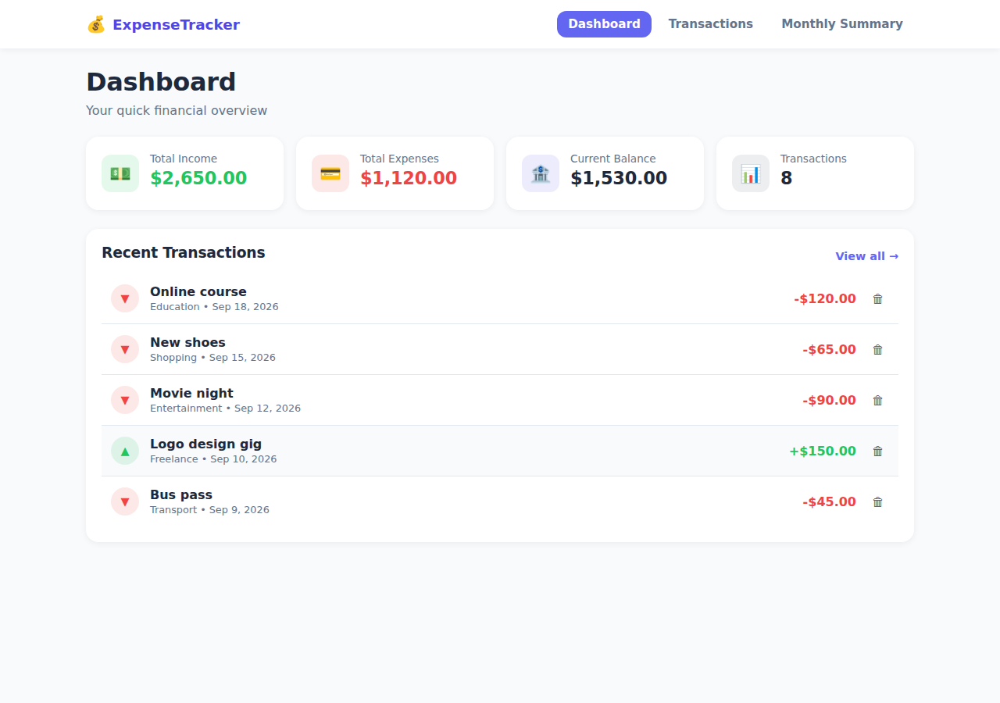
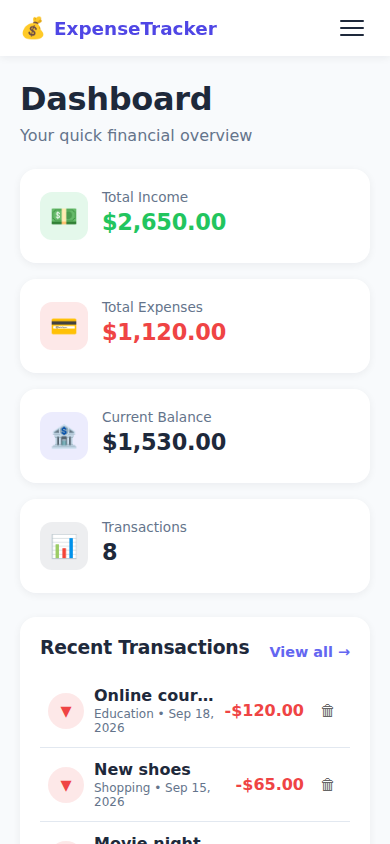
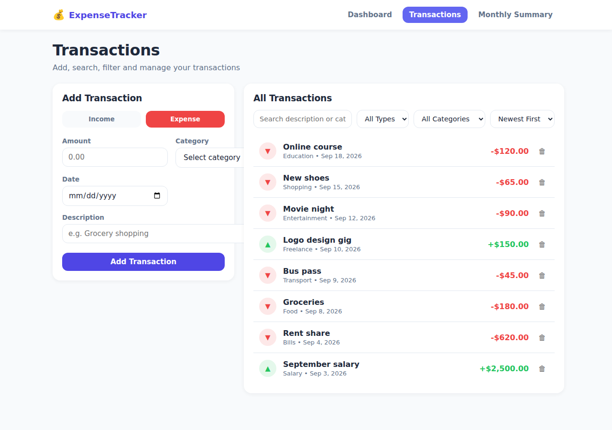
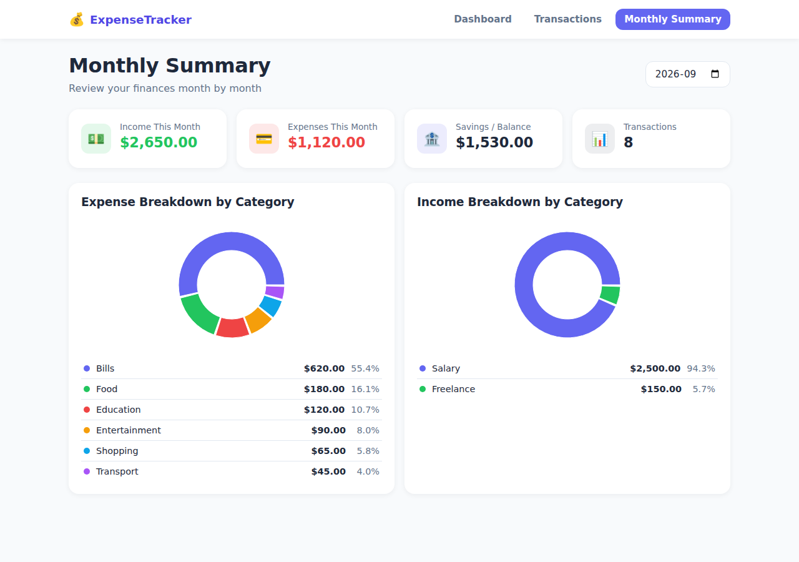

# Mero Hisab — Personal Expense Tracker

Mero Hisab is a React-based personal finance dashboard designed to help users track income, expenses, and monthly spending in one place. It provides a clear overview of current balance and spending patterns, making day-to-day financial management easier and more transparent.

## Features implemented

- Add income and expense transactions with amount, category, description, and date
- View the updated running balance using total income minus total expenses
- Review, filter, and sort transaction history
- Delete individual transactions from the list
- Monitor spending by category with a visual chart
- Access a monthly summary page with budget tracking and over-budget alerts
- Toggle between light and dark mode
- Save transactions and preferences locally in the browser using `localStorage`

## Technologies and libraries used

- React
- Vite
- React Router DOM
- Recharts
- React Toastify
- Tailwind CSS
- Browser `localStorage` for persistence

## Getting started

### Prerequisites

- Node.js (18+ recommended)
- npm

### Install and run

```bash
npm install
npm run dev
```

Then open the local development URL shown in the terminal.

> The project currently uses the Vite development server as its main run command. If you want a conventional `npm start` script, it can be added as an alias in the package configuration.

## Screenshots

### Dashboard overview



### Mobile dashboard



### Transactions page



### Monthly summary



## Known limitations

- Data is stored only in the browser via `localStorage`, so it is not synced across devices
- There is no backend, login system, or multi-user support
- Recurring transactions, export/import, and advanced reporting are not implemented yet
- The app is best suited for single-user personal budgeting rather than team or family finance tracking
